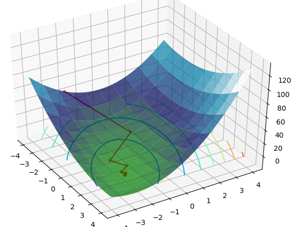

# 共轭梯度法
 > 共轭梯度法是求解线性系统 $Ax=b$最为流行的迭代方法。
 
$Ax=b$ 可以看做是$f(x)=\frac {1} {2}x^2-bx+c$函数的导数，因此，若$Ax=b$，则$f(x)$有极值。（注意A为非对称矩阵时$f'(x) =\frac{1}{2}A^Tx+\frac{1}{2}Ax-b$）
A矩阵若为正定，则有最小值；若为负定，则为最大值；若为非正定矩阵，将不存在极值点。

## 二次型
$f(x) = \frac {1} {2} x^TAx-b^Tx+c$
```python
import numpy as np
import sympy as sp
from sympy.abc import x,y
import matplotlib.pyplot as plt
from matplotlib import cm
from mpl_toolkits.mplot3d import Axes3D

X = sp.Matrix([x,y])

A = sp.Matrix([[3,2],[2,6]])
b = sp.Matrix([2,-8])

f = 1/2.*X.T*A*X+b.T*X

fx= f[0].simplify()
print (fx)

Z = []
data = np.linspace(-4,4,100)
X, Y = np.meshgrid(data, data)
for xv in data:
    temp = []
    for yv in data:
        res = fx.subs({x: xv, y:yv})
#        print type(res)
        temp.append(float(res))
    Z.append(temp)

Z = np.array(Z)

fig = plt.figure()
ax = Axes3D(fig) 
fig, ax = plt.subplots()
#ax.plot_surface(X, Y, Z, rstride = 10, cstride = 10, cmap = plt.get_cmap('rainbow'))

# 绘制从3D曲面到底部的投影,zdir 可选 'z'|'x'|'y'| 分别表示投影到z,x,y平面
# zdir = 'z', offset = -2 表示投影到z = -2上
ax.contour(X, Y, Z, zdir = 'z', offset = -2, cmap = plt.get_cmap('rainbow'))
plt.show()
```
# 最速下降两个概念
> 两个概念：误差$e_i=x(i)-x^*$（预测值和真实值），残差$r_i=b-Ax_i$（Ax与b值的偏差）。因此，$r_i=-f'(x)$。
> $r_i=b-Ax_i$
> $r_i=b-A(e_i+x^*)$
> $r_i=-Ae_i+b-Ax^*$
> $r(i)=-Ae(i)$
# 线性搜索
迭代逼近的过程如下式所示，其钟$\alpha$为搜索步长，$r$为搜索方向。
$x_{i+1}=x_i+\alpha r$
**Line search** is a procedure that chooses $\alpha$ minimize ; $f$ along a line. Figure illustrates this task: we are restricted to choosing a point on the intersection of the vertical plane and the paraboloid. Figure c is the parabola defined by the intersection of these surfaces.
图a从初始点x0开始，选取搜索方向r，依据$x_{i+1}=x_i+\alpha r$，获得函数搜索方向上的截线图c。那么所截得的线的函数为$f(x_i+\alpha r)$。其中，$x_i$为第i步的参数，而$\alpha$为唯一变量，因此转变成了一元方程$f(x_i+\alpha r_i)$的极值问题。
$\frac {d f(x_i+\alpha r_{i-1})} {d\alpha}=\frac {f(x_i)} {d(x_i)} \frac {dx_i} {d\alpha}=f'(x_i)^T r_{i-1}$
令,$f'(x_i)^T r_{i-1}=0$,$-f'(x_i)=-r_i$
即$r_i^Tr_{i-1}=0$
$(b-Ax_i)^Tr_{i-1}=0$
$(b-A(x_{i-1}+\alpha_i r_{i-1})^Tr_{i-1}=0$
$((b-Ax_{i-1})^Tr_{i-1}-\alpha_i A^T r_{i-1}r_{i-1}=0$
$\alpha_i=\frac {((b-Ax_{i-1})^Tr_{i-1}} { r_{i-1}^TAr_{i-1}}$
$\alpha_i = \frac {r_{i-1}^Tr_{i-1}} {r_{i-1}^TAr_{i-1}}$

 
 ```python
 import numpy as np
import sympy as sp
from sympy.abc import x,y
import matplotlib.pyplot as plt
from matplotlib import cm
from mpl_toolkits.mplot3d import Axes3D

def residual_initial(A,b,x0):
	return b-A.dot(x0)

def residual(A,alpha,r0):
    return r0-alpha*A.dot(r0)

def stepsize(A,r0):
    return r0.dot(r0.T)/r0.dot(A).dot(r0.T)

def threeDplot(X,Y,Z,data):
	fig = plt.figure()
	ax = Axes3D(fig) 
	ax.plot3D(data[:,0],data[:,1],data[:,2],'r')
	ax.scatter(data[:,0],data[:,1],data[:,2],marker='*',color='r')
	ax.plot_surface(X, Y, Z, rstride = 10, cstride = 10, cmap = plt.get_cmap('ocean'),alpha=0.7)
#	ax.plot_wireframe(X, Y, Z, rstride = 10, cstride = 10, cmap = plt.get_cmap('rainbow'))
	ax.contour(X, Y, Z, zdir = 'z', offset = -2, cmap = plt.get_cmap('rainbow'))
	ax.set_alpha(0.9)
	plt.show()


def Quadratic(A,b,X,Y):
	return 0.5*(A[0,0]*X*X+(A[0,1]+A[1,0])*X*Y+A[1,1]*Y*Y)-b[0]*X-b[1]*Y


if __name__ == '__main__':
	
	A = np.array([[3,2],[2,6]])
	b = np.array([2.,-8])
	data = np.linspace(-4,4,100)
	X, Y = np.meshgrid(data,data)
	Z = Quadratic(A,b,X,Y)


	x0 = [-4,-2]
	r = residual_initial(A,b,x0)
	maxerr =1E9
	i = 1
	x_loc = [[x0[0],x0[1],Quadratic(A,b,x0[0],x0[1])]]
	while maxerr > 0.01:
		alpha = stepsize(A,r)
		err = alpha*r
		x0 = x0 + err
		z = Quadratic(A,b,x0[0],x0[1])
		maxerr =max(err)
		print ("Run %d\nErr %10.5f" %(i,max(err)))
		print ('X:',x0,'Z',z)
		r = r-alpha*A.dot(r.T)
		i += 1
		temp = x0.tolist()
		temp.append(z)
		x_loc.append(temp)
threeDplot(X,Y,Z,np.array(x_loc))

 ```

[^1]:Jonathan Richard Shewchuk. An Introduction to the Conjugate Gradient Method Without the Agonizing Pain.1994